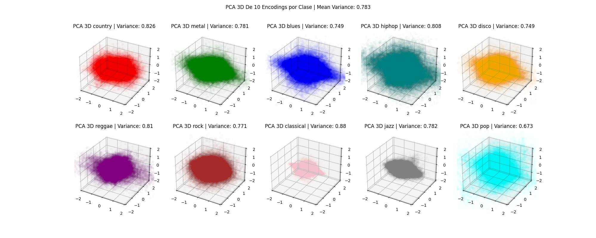
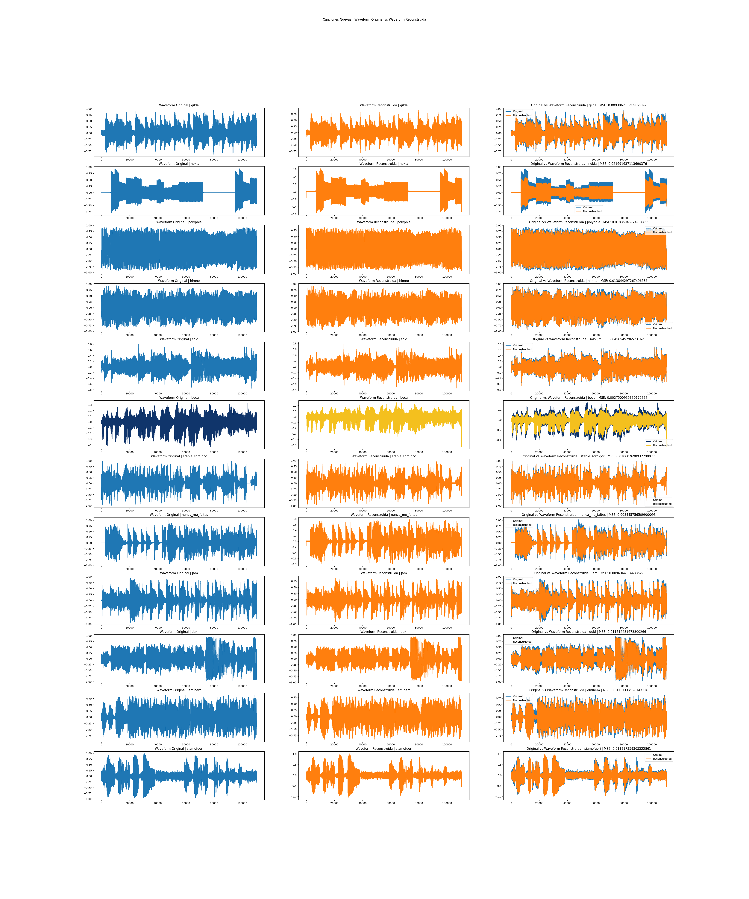
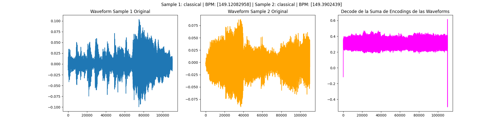

\newpage

## Introducción

Para este trabajo práctico se nos puso como objetivo implementar un encodeador de música con redes neuronales para poder obtener un vector representativo de las canciones en un espacio latente. 

Luego, estos vectores encontrados deben poder desencodearse para volver a reproducir el sonido original. Una vez aplicados el encoding y decoding, realizamos un análisis exploratorio para comprender y encontrar relaciones de estos nuevos vectores, los cuales serán explicados en el desarrollo del informe.

La base de datos usada para el desarrollo del mismo fue “GTZAN”. Esta cuenta con 1000 canciones, cada una con una duración de 30 segundos. Las canciones están divididas y clasificadas en 10 géneros distintos: blues, classical, country, disco, hip hop, jazz, metal, pop, reggae, y rock. 

Todos los archivos de audio de los que se habla en este informe, tanto los que se encodearon/desencodearon como la musica generada, se encuentran en la carpeta `wavs/`, los modelos entrenados en la carpeta `src/models/` y los plots en la carpeta `src/plots/`.

## 1) Encodear la canción en un vector latente

Comenzamos utilizando la clase brindada en la consigna llamada MusicDataset para cargar y procesar el conjunto de datos de música en formato WAV. Una vez que realizamos esto, separamos los datos en los conjuntos de validación, testeo y entrenamiento. La división que tomamos en cuenta fue fijar los tamaños de los conjuntos de validación y prueba en 100, mientras que el tamaño del conjunto de entrenamiento se calcula para abarcar el resto de los datos. Luego seteamos los DataLoaders respectivos a cada conjunto con un batch_size de 10 y 20. 

Con los distintos conjuntos ya creados, comenzamos con la creación e implementación del primer modelo usado. Para la visualización de las canciones, utilizamos los respectivos espectrogramas y formas de onda de cada canción. En primera instancia nos quedamos y basamos nuestro análisis en los espectrogramas. Para esto modificamos el MusicDataset para que por cada canción devuelva tambien un espectograma y un espectograma Mel a partir de las funciones de Torchaudio. Los espectogramas resultantes tenian una resolución de `512x256` por lo que comenzamos utilizando autoencoders cuyas convoluciones eran 2D. Esta idea fue descartada aunque en un comienzo su arquitectura se mantuvo pero con convoluciones 1D.

El primer modelo que utilizamos fue un autoencoder definido en la clase `autoencoder`. Un problema que tenía este modelo era que al decodear la canción, el tamaño obtenido no era exactamente el mismo que el original, por lo que luego de pasar por el bloque de deconvoluciones, le aplicamos una interpolación al tamaño original.

```
    Input Shape      : 110250      torch.Size([1, 1, 110250])
    Encoded Shape    : 55136      torch.Size([1, 32, 1723])
    Decoded Shape    : 110242      torch.Size([1, 1, 110242])
    Output Shape     : 110250      torch.Size([1, 1, 110250])
    Encoding Scale: 1/ 1.9996009866511897
```
La arquitectura del modelo es la siguiente:

\includepdf[pages=1, pagecommand={\thispagestyle{plain}\subsection{Arquitectura Net1}}]{src/plots/autoencoder.gv.pdf}

Este modelo no nos obtuvo buenos resultados, ya que el audio generado salia con un ruido constante de fondo. Inicialmente consideramos podía ser por la interpolación por lo que decidimos cambiar la arquitectura del modelo para que el tamaño de salida del decoder sea el mismo que el de entrada. Para esto, cambiamos el tamaño de los kernels de las convoluciones y deconvoluciones, y agregamos una capa de pooling en el encoder y una de unpooling en el decoder.

El modelo resultante, `autoencoder_alt2`, tiene la siguiente arquitectura:

```
    Input Shape      : 110250      torch.Size([1, 1, 110250])
    Encoded Shape    : 55216      torch.Size([1, 28, 1972])
    Decoded Shape    : 110250      torch.Size([1, 1, 110250])
    Output Shape     : 110250      torch.Size([1, 1, 110250])
    Encoding Scale: 1/ 1.9967038539553752
```

\newpage

\includepdf[pages=1, pagecommand={\thispagestyle{plain}\subsection{Arquitectura Net2}}]{src/plots/autoencoder_alt.gv.pdf}

Este modelo tampoco nos obtuvo buenos resultados. Como no estabamos logrando remover el ruido decidimos comenzar con un modelo desde cero implementado en la clase `autoencoder_alt3`. La idea que tuvimos fue mantener el vector encodeado en un tamaño mayor y bajar la cantidad de features.

```
    Input Shape       : 110250      torch.Size([1, 1, 110250])
    Encoded Shape    : 55125      torch.Size([1, 1, 55125])
    Decoded Shape    : 110250      torch.Size([1, 1, 110250])
    Output Shape     : 110250      torch.Size([1, 1, 110250])
    Encoding Scale: 1/ 2.0
```

La arquitectura de este modelo es la siguiente:

\includepdf[pages=1, pagecommand={\thispagestyle{plain}\subsection{Arquitectura Net3}}]{src/plots/autoencoder_alt3.gv.pdf}

\newpage

Para probar la eficiencia del modelo definimos la función de pérdida a usar, y optamos por “Mean Squared Error”. A su vez usamos optimizadores en el proceso de entrenamiento para ajustar los pesos y los sesgos de la red para minimizar la función de pérdida. Para ellos usamos el optimizador Adam.
En un comienzo cuando entrenamos el primer autoencoder obtuvimos mejores resultados con Adam que con SGD, por lo que continuamos usandolo para los próximos modelos. Para finetunear la taza de aprendizaje y los epochs corrimos un GridSearch sobre el modelo `autoencoder_alt3`, y a su vez sobre los modelos `autoencoder_alt4` y `autoencoder_alt5` que se explicarán más adelante. El espacio de busqueda que utilizamos es el siguiente:

```
    lrs = [0.001, 0.005, 0.01, 0.05, 0.0001, 0.0005]
    nums_epochs = [5, 10, 20, 30]
    models = [
        autoencoder_alt3,
        autoencoder_alt4, 
        autoencoder_alt5
    ]
```

A su vez se corrió con un scheduler con `step=4` y `gamma=0.5`.

```
    Mejor autoencoder_alt3:
        Por Mejor Train Loss: lr=0.01, epochs=30
        Por último Train Loss: lr=0.01, epochs=30
        Por Mejor Validation Loss: lr=0.01, epochs=30
        Por último Validation Loss: lr=0.01, epochs=30
    Mejor autoencoder_alt4:
        Por Mejor Train Loss: lr=0.01, epochs=30
        Por último Train Loss: lr=0.01, epochs=30
        Por Mejor Validation Loss: lr=0.01, epochs=30
        Por último Validation Loss: lr=0.01, epochs=30
    Mejor autoencoder_alt5:
        Por Mejor Train Loss: lr=0.005, epochs=30
        Por último Train Loss: lr=0.005, epochs=30
        Por Mejor Validation Loss: lr=0.005, epochs=30
        Por último Validation Loss: lr=0.005, epochs=30
```

A continuación se muestran las curvas de pérdida obtenidas para cada modelo.


\newpage


\newpage

Después de cada epoch, evalúa el modelo en un conjunto de validación y guarda las pérdidas. También guarda las reconstrucciones de un sample de Test en archivos de Numpy a medida que el modelo se va entrenando para poder visualizar su progresión. Además, utilizamos operaciones como `torch.cuda.empty_cache()`, `torch.mps.empty_cache()`, y `gc.collect()` para gestionar eficientemente la memoria RAM y GPU durante el proceso de entrenamiento.

Con el objetivo de encontrar un tamaño de vector óptimo para el análisis, probamos con diferentes configuraciones de autoencoders, que generan salidas de igual tamaño, pero diferentes salidas del autoencoder y del decoder. Estas variaciones se pueden dar por la definición de la arquitectura del autoencoder, ya que la cantidad y tipo de capas puede influir en las variaciones del tamaño de salida. También se pueden dar variaciones por la elección de la dimensionalidad del espacio latente, por las capas de pooling en el encoder usadas o por la definición de los hiper parámetros como stride y padding.

Los 3 modelos con los que obtuvimos mejores rendimientos no cuentan con funciones de activación en el proceso de encodear y desencodear ya que observamos que agregando las mismas, no mejoraba el rendimiento de los modelos. Para llegar a estos partimos de modelos más complejos, con funciones de activación como “ReLU” y “Tahn” y con Batch Normalization, pero fuimos disminuyendo la complejidad de los mismos, obteniendo ademas del “autoencoer_alt_3” los autoencoders “autoencoder_alt_4” y “autoencoderalt_5” que logran menores tamaños de salida del encoder.


Los tamaños durante el proceso de encodear y desencodear de los modelos son los siguientes:

### `autoencoder_alt4`

```
    Input Shape      : 110250      torch.Size([1, 1, 110250])
    Encoded Shape    : 36750      torch.Size([1, 1, 36750])
    Decoded Shape    : 110250      torch.Size([1, 1, 110250])
    Output Shape     : 110250      torch.Size([1, 1, 110250])
    Encoding Scale: 1/ 3.0
```

### `autoencoder_alt5`

```
    Input Shape      : 110250      torch.Size([1, 1, 110250])
    Encoded Shape    : 9189      torch.Size([1, 1, 9189])
    Decoded Shape    : 110250      torch.Size([1, 1, 110250])
    Output Shape     : 110250      torch.Size([1, 1, 110250])
    Encoding Scale: 1/ 11.998041136141039
```

Y sus arquitecturas se encuentran en las siguientes figuras:

\includepdf[pages=1, pagecommand={\thispagestyle{plain}\subsection{Arquitectura Net4}}]{src/plots/autoencoder_alt4.gv.pdf}

\includepdf[pages=1, pagecommand={\thispagestyle{plain}\subsection{Arquitectura Net5}}]{src/plots/autoencoder_alt5.gv.pdf}

## Resultados de los modelos entrenados

A continuación se muestran algunos ejemplos de audios encodeados y decodeados con los modelos `autoencoder_alt3`, `autoencoder_alt4` y `autoencoder_alt5`.


### Autoencoder_alt3 - Encoding a 1/2


[Audio Original]() - [Audio Reconstruido]()


\newpage

Otra cosa que probamos fue hacer un post procesamiento de la señal decodeada para mejorar y para eliminar el ruido que se generaba en el proceso de encodear y decodear. Para esto utilizamos por una parte un proceso de reescalado de la señal, y por otra parte un proceso de filtrado "High-Pass" de la señal usando `Scipy`.


Notamos que, aunque minimo, la MSE entre la señal con el postprocesamiento y la original es menor que la MSE respecto de la señal sin postprocesamiento.

| MSE Original | MSE Rescalada | MSE Rescalada + HP |
|--------------|---------------|--------------------|
| 0.004022     | 0.003808      | 0.003754           |

### Autoencoder_alt4 - Encoding a 1/3


[Audio Original]() - [Audio Reconstruido]()

### Autoencoder_alt5 - Encoding a 1/12


[Audio Original]() - [Audio Reconstruido]()

### Sobre datos de Test

A medida que el modelo se va entrenando, implementamos que se guarden las reconstrucciones de un sample de Test en archivos de Numpy para poder visualizar su progresión.


Por último nos interesaba ver la onda de la señal decodeada contra la original para ver si se podía observar alguna diferencia entre las mismas. El siguiente gráfico muestra la onda de la señal original y la decodeada con el modelo `autoencoder_alt3` con zoom para poder observar mejor las diferencias.


Pudimos notar que la onda parece acompañar a la original, pero con un ruido constante de fondo en forma de picos.

## 2) Análisis exploratorio de los vectores latentes


### Analisis de Componentes Principales

Para el análisis planteado, comenzamos utilizando el método PCA (Análisis de componentes principales) para reducir la dimensionalidad y poder manipular los encodings en un espacio reducido. Nuestra intención era que estos vectores capturan características importantes o patrones subyacentes en los datos.

Un primer análisis que realizamos fue sobre los vectores latentes obtenidos con el modelo `autoencoder_alt3`. Seleccionamos una canción de muestra de cada clase y obtuvimos su encoding de tamaño `1x55125`. Para aplicar la reducción de dimensionalidad le hicimos un reshape a cada vector para que quede de tamaño `55125 // 5 x 5`. Luego, aplicamos PCA con 2 componentes y graficamos los resultados para observar la dispersión en el espacio 2D, y obtener información sobre la variabilidad y la estructura de las codificaciones en cada clase.


Al hacer PCA a 2 dimensiones no logramos discernir ninguna estructura muy crítica en los datos. A simple vista se puede decir que algunas canciones se encuentran mas dispersas que otras sobre el espacio de las componentes principales. Para continuar la exploración, en vez de encodear una canción de cada clase, encodeamos 10 canciones de cada clase, de esta forma nuestro tensor sería "representativo" de una clase y no de una canción en particular. Para ello a partir de un tensor de tamaño `10x1x55125` concatenamos los encodings de las 10 canciones de cada clase y obtuvimos uno de tamaño `1x551250` al que tambien le hicimos un reshape para que quede de tamaño `551250 // 5 x 5`. Luego, aplicamos PCA con 2 componentes y graficamos los resultados para observar la dispersión en el espacio 2D, y obtener información sobre la variabilidad y la estructura de las codificaciones en cada clase.


Los resultados que obtuvimos no lograron ser muy diferentes a los anteriores, por lo que decidimos hacer PCA a 3 dimensiones para poder visualizar mejor los datos. A continuación se muestran los resultados obtenidos.




### Similitud entre canciones

Por otra parte, partimos de los vectores originales, tanto los codificados como los decodificados, y tomamos 10 muestras de cada clase. Calculamos la similitud coseno entre las muestras de cada clase, considerando tanto los vectores originales de una canción en una clase como los vectores originales de otra canción de la misma clase, así como los vectores codificados de una clase y los vectores codificados de una canción de la misma clase. Este análisis nos permitió observar las similitudes o diferencias entre las muestras.


A partir de los resultados concluimos que, entre canciones de las mismas clases, tanto los vectores originales como decodificados son ortogonales entre si (es decir no son iguales), pero los vectores codificados resultan ser muy similares, esto lo podemos ver ya que la media de las distribuciones de similitud coseno entre canciones de la misma clase ronda los $\tilde 0.8$, nuestra primera hipótesis es que esto se debe a que las canciones de una misma clase tienen características similares, por lo que al encodearlas se obtienen vectores similares entre si.

### Similitud entre clases

Por último, realizamos un análisis de similitud entre clases. Para ello, tomamos 10 muestras de cada clase y calculamos la similitud coseno entre las muestras de cada clase, considerando tanto los vectores originales de una clase como los vectores originales de otra clase, así como los vectores codificados de una clase y los vectores codificados de otra clase. Este análisis nos permitió observar las similitudes o diferencias entre las clases.


Los resultados refutaron nuestra hipotesis ya que las distribuciones de similitud coseno entre canciones de distintas clases resultaron ser muy similares a las distribuciones de similitud coseno entre canciones de la misma clase. Esto nos dió un mejor entendimiento del porque los resultados de PCA no fueron los esperados, ya que al encodear las canciones, se pierde mucha información y se obtienen vectores muy similares entre si.


## 3) Encodear música nueva

Una vez entrenado el modelo y pasado nuestro propio test de validación auditivo, es decir, una vez que al escuchar la reconstrucción de test estabamos conformes con el resultado, utilizamos nuevas canciones fuera del dataset para corroborar que funcione y el resultado fue positivo. El resultado fue similar al que obtuvimos con las canciones del dataset. Para esta sección no usamos todos los modelos que en entrenamiento, sino que usamos solo el `autoencoder_alt_3`, previamente explicado, porque como solo reduce la entrada a la mitad, permite obtener mejores resultados para estas canciones nuevas al dataset.  Para poder utilizarlas, las adaptamos al mismo formato que las canciones del dataset. 

Los audios que elegimos para esta sección son los siguientes:

### Canciones fuera del Dataset de Otros Generos

Por una parte probamos con canciones de otros géneros que no se encuentran en el dataset.

#### Cumbia Argentina
- [No me arrepiento de este amor - Gilda]()
- [Nunca Me Faltes - Antonio Rios]()

#### Rap y Trap
- [Rap God - Eminem]()
- [Givenchy - Duki]()

#### Funk
- [J.A.M. - Cory Wong]()

#### Rock Progresivo
- [All Falls Apart - Polyphia]()

### Audios Varios

Ademas probamos con otros audios que no son canciones, sino que son sonidos o audios de otros tipos.

- [Ringtone Nokia]()
- [Himno Argentino Cancha]()
- [Trompetas de la 12 - Boca]()
- [Audio Solo de Guitarra]()
- [Sorting Sounds - Stable Sort GCC]()
- [Relato Siamofuori della Copa - Italia 90]()


### Resultados

A oído los resultados fueron satisfactorios, ya que se puede escuchar la canción original en la reconstrucción. A continuación se muestran algunos ejemplos de audios encodeados y decodeados con el modelo `autoencoder_alt3`. Los audios parecen provenir de adentro de un contender pero no se escucha ruido de fondo como esperabamos.



En cuanto a la perdida, el MSE en la mayoría de los casos es un orden de maginitud mayor que el obtenido con las canciones del dataset, pero sigue siendo al rededor de $0.01$ por lo que consideramos que es un buen resultado.

| Canción | MSE |
|---------|-----|
| gilda | MSE: 0.00939|
| nokia | MSE: 0.02169|
| polyphia | MSE: 0.01835|
| himno | MSE: 0.01384|
| solo | MSE: 0.00458|
| boca | MSE: 0.00275|
| stable_sort_gcc | MSE: 0.01060|
| nunca_me_faltes | MSE: 0.00844|
| jam | MSE: 0.00963|
| duki | MSE: 0.01171|
| eminem | MSE: 0.01434|
| siamofuori | MSE: 0.01181|

## 4) Generación de Música

Con la intención de crear música original, comenzamos utilizando un tensor con valores aleatorios y procedimos a decodificarlo. Sin embargo, el resultado de este proceso fue esencialmente ruido. 


Posteriormente, exploramos la opción de un vector cuyos valores estaban determinados por la función seno.


Algo que nos sorpendio es que la onda generada no se encuentra centrada en 0 por lo que no se puede escuchar. Esto es porque nuestro modelo no cuenta con una función de activación estilo "Tanh" que nos permita obtener valores entre -1 y 1. Para poder escuchar la onda le sumamos la media de la onda pero igual no se logra escuchar mucho.

Después de estas primeras experiencias, decidimos tomar dos canciones pertenecientes a la misma categoría y que tengan BPMs (beats por minuto) cercanos para luego sumar sus codificaciones. Al decodificar este resultado, notamos que el sonido resultante era similar a la suma de las dos canciones originales.



Por último, decidimos tomar dos canciones pertenecientes a la misma categoría y que tengan BPMs (beats por minuto) cercanos para luego promediar sus codificaciones. En este caso obtuvimos un muy buen resultado, cabe resaltar que en parte fue el azar pero también se debe a que las canciones elegidas son muy parecidas entre si por haber hecho la selección de BPMs cercanos.


Por último, entrenamos un clasificador Random Forest a partir de los encodings de las canciones del dataset. Para cada encoding, toma los $n$ atributos más importantes y los descartamos con el objetivo de observar cómo estos afectan en la reconstrucción. Decidimos primero anular los primeros 1000 atributos mas significativos a la clasificación y obtuvimos los siguientes resultados:


MSE - Sample Original y Reconstruido: 0.0049
MSE - Sample Original y Reconstruido con los primeros 1000 atributos anulados: 0.0084
MSE - Reconstruido y Reconstruido con los primeros 1000 atributos anulados: 0.0034

Para explorar más a fondo, ploteamos la MSE entre el sample original y el reconstruido a partir de encodings con los primeros $n$ atributos anulados, para distintos valores de $n$.


